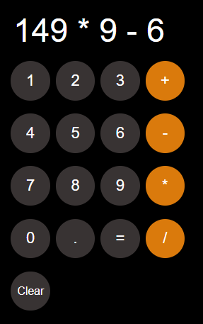

# Calculator App

A simple web-based **Calculator** built with HTML, CSS, and JavaScript.  
It supports basic arithmetic operations (+, -, *, /), decimal points, and clears history.  
The calculator also **remembers the last calculation** using `localStorage`.

## Preview

## Features

- Basic arithmetic: addition, subtraction, multiplication, division.
- Decimal point support.
- Clear button to reset calculation.
- Stores last calculation in browser using `localStorage`.
- Interactive buttons with hover and focus effects.

## Technologies Used

- HTML5
- CSS3
- JavaScript (ES6+)

## Usage

1. Clone or download the repository.
2. Open `index.html` in your web browser.
3. Click the number and operator buttons to perform calculations.
4. Press `=` to calculate the result.
5. Press `Clear` to reset the calculator and clear stored history.

## File Structure

root/
├─ index.html
├─ script.js
├─ Styles.css
├─ screenshot.PNG

## Author

Samuel Fikiru

## License

This project is open-source and free to use.
